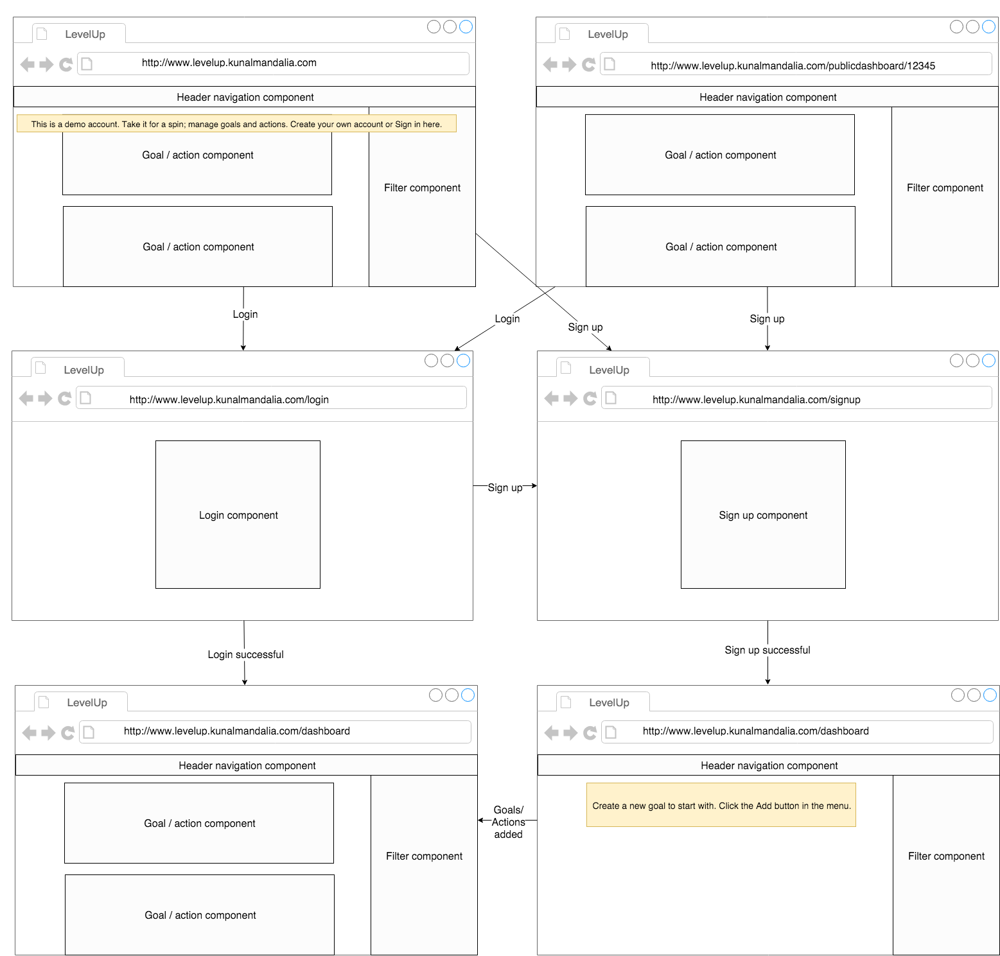
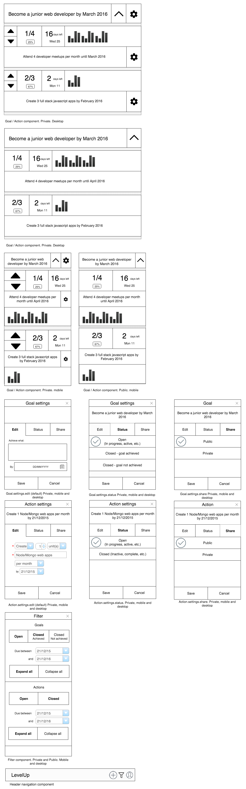
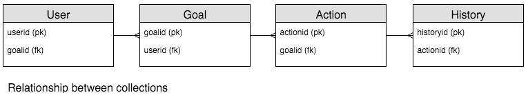

# LevelUp App Spec

### Elevator pitch
Your goals may be big or small but either way you’ll need to pay deliberate attention to achieve them. By taking the pain out of the process of creating and tracking your goals, you’ll be happy to see them in one place and mark out your progress against them.

You’ll get insight into questions like how many hours have I spent learning the latest front-end framework, or over the past three months how close am I to speaking conversant Spanish or how about how often do I speak with my parents every year. If it’s important to you, put a metric on it and LevelUp.

### User stories
As a goal-oriented user I want to manage (CRUD) goals and assign timed targets e.g. spend 20 hours in total learning Spanish or spend 3 hours every week exercising, so I can track progress on goals. (Must-have, phase 1)

As a goal-oriented user I want to group goals together under a mission to describe the underlying why behind the goals. (Must-have, phase 1)

As a goal-oriented user I want to see a snapshot of my progress; current and longest streak, similar to Github’s contributions, so I can stay more motivated consistently throughout the year. (Should-have, phase 2/3)

As a goal-oriented mobile user I want to quickly and easily update time spent against my goals so keeping data fresh isn’t neglected due to administrative burden. (Must-have, phase 1)

As a goal-oriented user I want my goals to be open and sharable but not editable by anyone else so I can hold myself publicly accountable to working toward my goals. (Must-have, phase 1)

As a developer who’s recently learned about MongoDB and the MEAN stack, I want to use this JavaScript stack to build a web application fit for desktop, tablet and mobile so I can gain experience building modern full stack JavaScript applications (Must-have, phase 1)

As a developer I want the user to have the option to login via traditional email/password (local auth) or via their Google account (OAuth) so I can gain experience providing mixed authentication options. (Must-have, phase 1)

As a goal-oriented user I want to see live progress on my goals now and over time so I can quickly identify adjustments I should make (Must-have, phase 1)

As a goal-oriented user I want to schedule time for goals and update their status via a calendar so I can better plan my week and easily update progress against goals (Should-have, phase 2)

As a health conscience user I want to create and track goals my FitBit collects so I don’t have to manually capture the data myself and see all goals in one place (Should-have, phase 2) 

As a busy user I want to be notified of actions due soon so I can be reminded of my commitments with less risk of forgetting them (Should-have, phase 2)

### Wireframes
Although this app will not be created as a native mobile app (at least at the time of writing) the design principle will still be mobile first to accommodate the smallest practical device, indeed it’ll be the mobile where the user updates progress on goals most often. Credit to draw.io for providing a great free tool for wireframing.

##### Storyboard
The typical journey for the end-user will start with them accessing http://levelup.kunalmandalia.com/ I’ve chosen to host the app as a subdomain on my personal site for simplicity, this may change. The user will see a live demo account, which they can take for a spin to get a feel for how goals and actions work and then register for an account. This demo account will have its goals and actions reset every hour. Once registered, the user can add a goal and then actions, and track them. There’ll also be an option for the user to share their goal as per user story 5, so the end user may access LevelUp via a link from their friend showing their live progress.



##### Components
The UI blocks as outlined in the storyboard can be thought of as components; header navigation, sidebar filter menu, goal / action boxes, etc. The Goal / Action boxes deserve special mention. (SMART) Goals describe a particular state in the future e.g. by Q2 2016 work full time as a full stack javascript engineer. Goals don’t however say how you’re going to achieve them, instead we need something to tie together the day to day activities which help us achieve our goals, we’ll call these Actions. Actions are practical actionable goals that help form the everyday habits required to achieve (bigger) goals, e.g. Dedicate 4 hours a day developing 2 full stack javascript apps until Q1 2016. Actions are measured frequently, typically daily or weekly, they’re the pulse of the goal.



### Frontend decisions
I’ll be using Angular 1,x on as the frontend framework. Despite React gaining much popularity, just getting some experience of MV* on the client side will be a beneficial learning experience, it’s also 100% JavaScript hence meeting user story 7. Material Design Lite by Google will be used to turn the app responsive addressing user story 6, and also provide a clean modern design.

### Backend decisions
##### Server
The app will sit on a Node.js server. Node was chosen because it runs JavaScript hence meeting user story 7 and lends itself quite nicely to creating REST APIs with the help of express.js

##### Database and Schema
MongoDB will be the backend NoSQL database used to persist the following collections of data; user, goal, action, history

The relationship between these collections is as follows:


The primary reason for choosing MongoDB is that it runs JavaScript hence addressing user story 7. Mongoose will be used to enforce the following schemas for the mentioned collections:

```
db.user: {
	“_id”: Object Id,
    “name”: String,
    “email”: String,
    “login”: {
            	“googleOAuth”: 32-bit integer,
            	“password”: String (hash)
    }
}

db.goal: {
	“_id”: Object Id,
	“description”: String,
	“due”: Date,
    “status”: String // {Open, Closed - goal achieved, Closed - goal not achieved},
    “public”: Boolean,
	“_userid”: Object Id
}

db.action: {
	“_id”: Object Id,
    “_goalid”: Object Id,
	“public”: Boolean, // virtual
	“verb”: String,
	“verb_quantity”: 32-bit integer,
	“verb_unit”: String,
	“noun”: String,
	“period”: String (optional),
	“expire”: Date,
	“progress”: {
            		“running_total”: 32-bit integer, // via +1/-1 progress counter
            		“maximum”: 32-bit integer // virtual
            		“current_period”: 32-bit integer, // virtual
    }
}

db.history : {
	“_id”: Object Id,
	“progress_item”: 32-bit integer,
    “date_added”: Date,
    “_actionid”: Object Id
}
```
The action schema may look cryptic but the following examples of actions and how they syntactically map onto the action schema should provide clarity:

Speak (*verb*) 5 (*verb_quantity*) hours (*verb_unit*) of Spanish (*noun*) every month (*period*) for one year (*expire*)

Develop (*verb*) 4 (*verb_quantity*) full-stack JavaScript web apps (*noun*) (*period - omitted*) by February 2016 (*expire*)

Attend (*verb*) 2 (*verb_quantity*) JavaScript meetups (*noun*) per month (*period*) until June 2016.

In terms of the schema design, I’ve tried to bear in mind two principles (highlighted by Valeri Karpov in his [MongoDB and the MEAN stack course](https://www.edx.org/course/introduction-mongodb-using-mean-stack-mongodbx-m101x)):
Store what you query for
Principle of least cardinality - a key part being not to nest arrays which grow without bound within a mongo document.
Despite the fact that on the tracking screen the user is presented with goals and their associated actions, nesting actions within goals (store what you query for) would violate the principle of least cardinality - causing potential issues if the list of goals associated with a goal grows too large (which could happen for high frequency actions). In fact, any of the collections may grow without bound hence they’re separated.


##### API design

The API will be RESTful, the supported relative URI routes along with the http verb actions available for LeveUp are shown below:

| http verb(s) | Relative URI | Description | Returns |
| ------------ | ------------ | ----------- | ------- |
| get          | /api/v1/user/:id | get user by userid | JSON object|
| get/put/post/delete | /api/v1/action/:actionid | get/put/post/delete action by actionid | JSON object|
| get/put/delete | /api/v1/action/goal/:id | get/put/delete actions(s) by goalid | get - JSON object(s), put/delete - JSON object |
| get/put/post/delete | /api/v1/goal/:id | get/put/post/delete goal by goalid | JSON object |
| get/delete | /api/v1/goal/user/:id | get/delete goal(s) by userid | get - JSON object(s), delete - JSON object |
| get/put/post/delete | /api/v1/history/:id | get/put/post/delete history item by historyid | JSON object |
| get/delete | /api/v1/history/action/:id | get/delete history item(s) by actionid | get - JSON object(s), delete - JSON object |